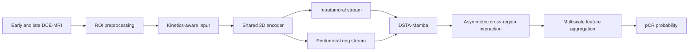

# RAPSS-Net

**Region-Aware Progressive Selective State-Space Network for 3D DCE-MRI**

RAPSS-Net is a research implementation for predicting pathologic complete response from pretreatment, multiphase breast DCE-MRI. The model combines lesion-centered 3D representation learning, explicit intratumoral/peritumoral streams, dynamic tri-axial state-space modeling, asymmetric cross-region interaction, and multiscale feature aggregation.

This repository contains model, preprocessing, training, validation, explainability, and reporting code. Imaging cohorts, clinical tables, checkpoints, and patient-level outputs are intentionally excluded.

## Architecture



The main implementation is [`models/lesion_centric_3d_net.py`](models/lesion_centric_3d_net.py). Dynamic stepwise tri-axial scanning and cross-region interaction are implemented in [`models/blocks/contextual_mamba_block.py`](models/blocks/contextual_mamba_block.py).

## Repository layout

```text
RAPSS-Net/
├── configs/server/          # preprocessing and experiment configs
├── datasets/                # NPY-based multiphase MRI dataset
├── engine/                  # training and evaluation loops
├── losses/                  # task and auxiliary losses
├── models/                  # RAPSS-Net and 3D building blocks
├── pre/                     # NIfTI-to-NPY ROI preprocessing
├── tests/                   # configuration, split, and model tests
├── tools/                   # profiling and report utilities
├── utils/                   # metadata, metrics, logging, configuration
├── train.py                 # pooled cross-validation entry point
├── run_random_split.py      # patient-level random split experiment
├── run_internal_cv.py       # internal holdout plus five-fold CV
├── run_external_validation.py
└── explain.py               # model explainability
```

## Data contract

Preprocessed studies are expected in this layout:

```text
data/processed/
├── images/<case_id>.npy     # [phase, depth, height, width]
├── masks/<case_id>.npy      # [1, depth, height, width]
└── dataset_metadata.csv
```

Required metadata columns are `id`, `label` (0/1), and `center`. `patient_group` is optional and prevents multiple scans from the same patient crossing split boundaries. See [`data/metadata.example.csv`](data/metadata.example.csv); all rows are synthetic.

Public cohorts such as I-SPY 1, I-SPY 2, and Duke-Breast-Cancer-MRI must be obtained under their own access terms. The repository does not redistribute them.

## Installation

Python 3.10 and a CUDA-enabled PyTorch environment are recommended.

```bash
python -m venv .venv
source .venv/bin/activate
pip install -r requirements.txt
```

On Windows, activate with `.venv\\Scripts\\activate`. A pure-PyTorch reference Mamba layer is included in `mamba_ssm.py`; an optimized `mamba-ssm` installation can be substituted for supported Linux/CUDA environments.

## Run

Edit the relative data paths and center names in the supplied YAML files, then run:

```bash
# Optional preprocessing from authorized NIfTI data
python pre/prepare_all_to_npy_mask.py -c configs/server/prep_config_public_server.yaml

# Patient-level random split
python run_random_split.py -c configs/server/random/train_config_RAPSS_Net.yaml

# Internal holdout followed by five-fold cross-validation
python run_internal_cv.py -c configs/server/cv/train_config_RAPSS_Net.yaml

# Reproduce the configured training and evaluation workflow
python run_reproduce_all.py \
  --random_config configs/server/random/train_config_RAPSS_Net.yaml \
  --cv_config configs/server/cv/train_config_RAPSS_Net.yaml
```

To evaluate a direct external cohort:

```bash
python run_external_validation.py \
  -c configs/server/cv/train_config_RAPSS_Net.yaml \
  --test_csv data/external/metadata.csv \
  --data_dir data/external \
  --model_path outputs/cv/fold_1/best_model.pth \
  --output_dir outputs/external
```

## Research scope

RAPSS-Net is medical 3D perception research rather than a robot navigation stack. Its transferable components for embodied perception are volumetric feature learning, region-aware spatial interaction, and adaptive axis-wise state-space routing.

The accompanying manuscript is under preparation. Reported performance should be interpreted only with the cohort definitions, split protocol, and statistical analysis in the manuscript. This code is provided for transparent method inspection and reproducible experimentation; it is not a medical device.

## Author

**Lijun Jin (金利军)** · [GitHub](https://github.com/June027)
